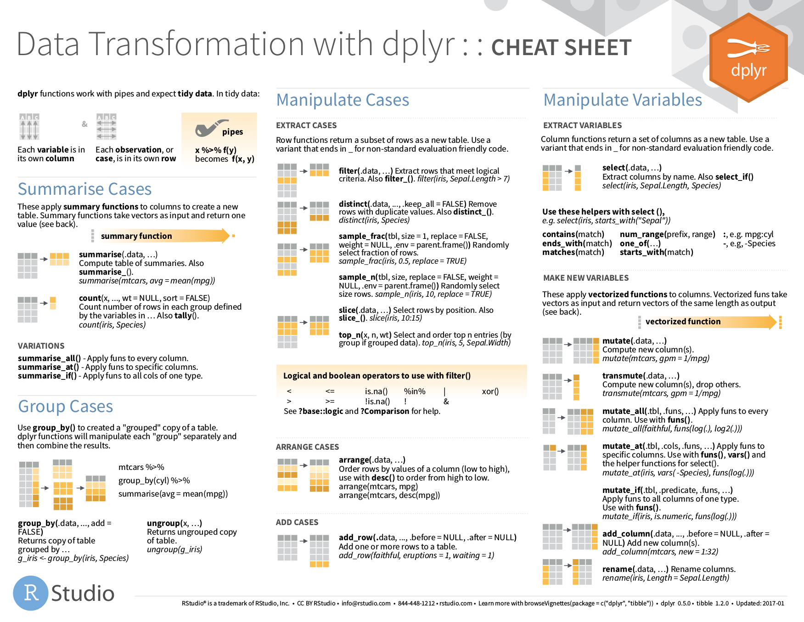
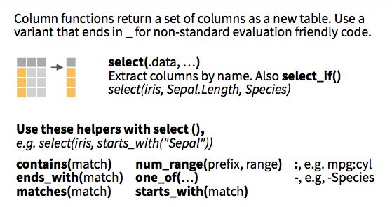
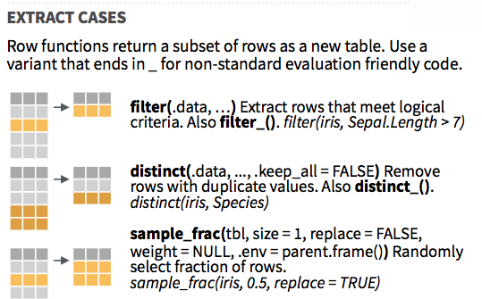
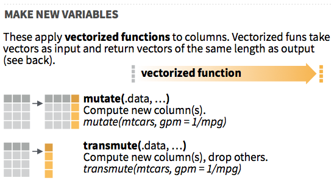
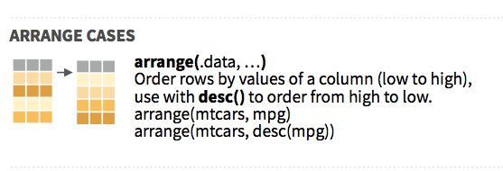
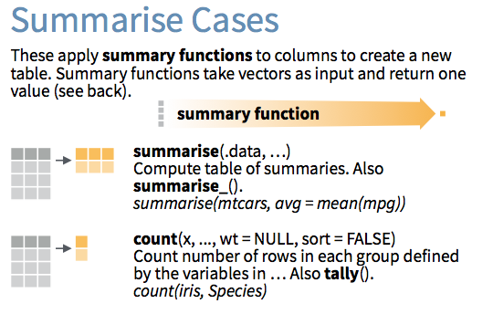
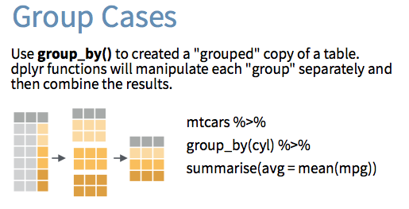
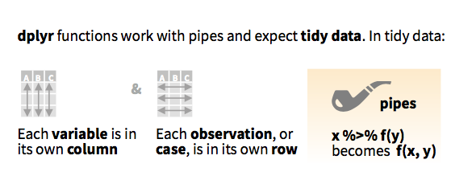
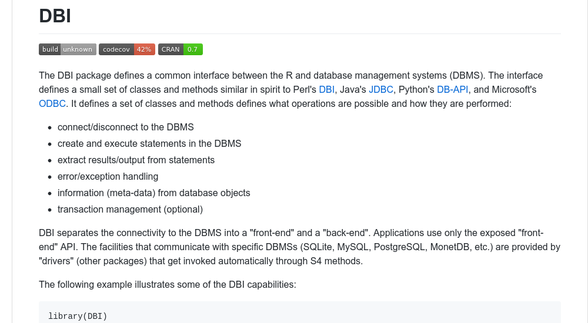

```{r, echo=FALSE, message=FALSE}
knitr::opts_chunk$set(engine.opts = "--defaults-group-suffix=clientscidb -t imdb")
library(mdsr)
library(RMySQL)
db <- dbConnect_scidb(dbname = "imdb")
```


## Databases in the tidyverse  { .white }


</br></br></br></br>
</br></br></br>

<p class="white">
ASA Webinar</br>
Ben Baumer & Nick Horton</br>
November 15, 2017</br>
</p>


## Map of this webinar

#. review key idioms for data wrangling with `dplyr`
#. introduce the backend interfaces for common database systems
#. provide examples of how the `dplyr` engine translates a data pipeline
#. discuss common misconceptions and performance issues
#. provide pointers on how to learn more

## &nbsp; { .white }


## &nbsp; { .white }


# `dplyr`

```{bash, eval=FALSE}
shutter -w=.*data-transformation.* -s=100,100,300,300 -o select.png -e
```

## `dplyr` highlights

<div class="double">
The Five Verbs

- `select()`
- `filter()`
- `mutate()`
- `arrange()`
- `summarize()` 

Plus:

- `group_by()`
- `rename()`
- `inner_join()`, `left_join()`, etc.
- `do()`
</div>

## Philosophy

- Each *verb* takes a data frame and returns a data frame
    - actually a `tbl_df` (more on that later)
    - allows chaining with `%>%` (more on that later)
- Idea: 
    - master a few simple commands
    - use your creativity to combine them
- Cheat Sheet:
    - (https://www.rstudio.com/resources/cheatsheets/)

## &nbsp; { .fullpage .white }



## What is a tibble?

<div class="double">


- object of class `tbl`
- a re-imagining of a `data.frame`
- it looks and acts like a `data.frame`
- but it's even better...
- `tidyverse` works with tibbles
</div>

## `select()`: take a subset of the **columns** 

<div class="centered">
  
</div>

## `filter()`: take a subset of the **rows**

<div class="centered">
  
</div>

## `mutate()`: add or modify a **column**

<div class="centered">
  
</div>


## `arrange()`: sort the **rows**

<div class="centered">
  
</div>


## `summarize()`: collapse to **a single row**

<div class="centered">
  
</div>

## `group_by()`: apply to groups

<div class="centered">
  
</div>


# The pipe

## `magrittr`


## Aside: `magrittr`


<div class="double">


- [The Treachery of Images](https://en.wikipedia.org/wiki/The_Treachery_of_Images)
- Pipe (`%>%`) is provided by `magrittr` package
- Inspired by pipe (`|`) in UNIX

</div>

## How does the pipe work?

<div class="centered">
  
</div>

## Using the pipe

The expression

```{r, eval=FALSE}
mydata %>%
  verb(arguments)
```

is the same as:

```{r, eval=FALSE}
verb(mydata, arguments)
```

In effect, `function(x, args) = x %>% function(args)`.

## Why the pipe?

Instead of having to read/write:

```{r, eval=FALSE}
select(filter(mutate(data, args1), args2), args3)
```

You can do:

```{r, eval=FALSE}
data %>%
  mutate(args1) %>%
  filter(args2) %>%
  select(args3)
```


## Coding Little Bunny Foo Foo

- Nested form:

```{r, eval=FALSE}
bop(scoop(hop(foo_foo, through = forest), up = field_mice), on = head)
```

- With pipes:

```{r, eval=FALSE}
foo_foo %>%
  hop(through = forest) %>%
  scoop(up = field_mouse) %>%
  bop(on = head)
```

(https://github.com/hadley/r4ds/blob/master/pipes.Rmd)

## Example: fuel economy

```{r}
mtcars %>%
  filter(am == 1) %>%
  group_by(cyl) %>%
  summarize(num_models = n(), 
            mean_mpg = mean(mpg)) %>%
  arrange(desc(mean_mpg))
```

## Example: the 300-300 club

```{r}
library(Lahman)
Batting %>%
  group_by(playerID) %>%
  summarize(span = paste(min(yearID), max(yearID), sep = "-"), 
            career_HR = sum(HR), career_SB = sum(SB)) %>%
  filter(career_HR >= 300, career_SB >= 300) %>%
  left_join(Master, by = "playerID") %>%
  mutate(player_name = paste(nameLast, nameFirst, sep = ", ")) %>%
  select(player_name, span, career_HR, career_SB) %>%
  arrange(desc(career_HR))
```


# `dbplyr`

## A brief primer on SQL 

<div class="double">


- SQL is not just one thing
    - MySQL, PostgreSQL, SQLite
    - Oracle, Big Query, Vertica
- Theory developed in 1970s (E.F. Codd)
- Ingres implemented mid-1970s
- robust, time-tested, well understood
</div>


## `dplyr` <-> SQL

<div class="double">
`dplyr`
```{r, eval=FALSE}
table %>%
  filter(field == "value") %>%
  left_join(lkup, 
    by = c("lkup_id" = "id") %>%
  group_by(year) %>%
  summarize(N = sum(1)) %>%
  filter(N > 100) %>%
  arrange(desc(N)) %>%
  head(10)

```

MySQL
```{sql, eval=FALSE}
SELECT
  year, sum(1) as N
FROM table t
LEFT JOIN lkup l
  ON t.lkup_id = l.id
WHERE field = "value"
GROUP BY year
HAVING N > 100
ORDER BY N desc
LIMIT 0, 10;
```
</div>

## &nbsp;


## `dbplyr` = `dplyr` + SQL connection

- `dplyr` can access a SQL database directly
- Instead of `tbl_df`, you have a `tbl_sql`
- Data is stored and processed in SQL
    - Tiny memory footprint in R
    - **Lazy evaluation**
    - server-side processing
- `dplyr` to SQL translation via `show_query()`


## Example: connect to remote IMDB mirror

```{r}
db <- src_mysql(db = "imdb", host = "scidb.smith.edu",
                user = "mth292", password = "RememberPi")
title <- tbl(db, "title")
title
```

## `title` contains 4.6 million rows, but...

- ...it takes up almost no space

```{r}
print(object.size(title), units = "Kb")
```

- `title` looks like a `data.frame` but...

```{r}
class(title)
```

- ...it's not actually a `data.frame`

## Example: `show_query()`

```{r}
star_wars <- title %>%
  filter(title == "Star Wars", kind_id == 1) %>%
  select(production_year, title)
star_wars
show_query(star_wars)
```

## Translation of basic functions

```{r, message=FALSE}
library(dbplyr)
translate_sql(ceiling(mpg))
translate_sql(mean(mpg))
translate_sql(cyl == 4)
translate_sql(cyl %in% c(4, 6, 8))
```

## Code pass-thru of other functions

```{r, message=FALSE}
# no PASTE() in SQL
translate_sql(paste("hp", "wt", "vs"))

# works, but no CONCAT() in R
translate_sql(CONCAT("hp", "wt", "vs"))

# nonsense
translate_sql(CRAZY_FUNCTION(mpg))
```

## Fine-looking R code

```{r lazy-pipeline}
title %>%
  filter(title %like% '%Star Wars%',
         kind_id == 1,
         !is.na(production_year)) %>%
  select(title, production_year) %>%
  arrange(production_year)
```

## Weird-looking hybrid code

```{r hybrid}
title %>%
  filter(title %like% '%Star Wars%',
         kind_id == 1,
         !is.na(production_year)) %>%
  mutate(before_dash = SUBSTRING_INDEX(title, '-', 1)) %>%
  select(before_dash, production_year) %>%
  arrange(production_year)
```

## Why `dplyr` vs. SQL?

<div class="double">
R + `dplyr` good at:

- fitting models
- plotting
- wrangling data of all kinds
- working with small data
- being an *interface to SQL*


SQL good at:

- storage and retrieval
- medium-to-big data
- multi-user, asynchronous access
- serving institutional needs
- web/mobile apps
</div>

## Data size for a single user

<style>
.storage {
   float: left;
}
</style>

<div class="storage"></div>

<div class="storage"></div>

<div></div>


"Size" | size | hardware | software
-------|------|----------|-----
small  | < several GB | RAM | R
medium | several GB -- a few TB | hard disk | SQL
big    | many TB or more | cluster | Spark?

# `DBI`

## `DBI`

```{r, eval=FALSE, include=FALSE}
library(webshot)
webshot("https://github.com/r-dbi/DBI", file = "gfx/dbi.png", 
        cliprect = c(1250, 0, 1000, 550))
```

<div class="centered">
  [](https://github.com/r-dbi/DBI)
</div>

## &nbsp;


## &nbsp;


## Supported databases

<div class="double">
`r-dbi`:

- `RSQLite` [](https://cran.r-project.org/package=RSQLite)
- `RMySQL` [](https://cran.r-project.org/package=RMySQL)
- `odbc` [](https://cran.r-project.org/package=odbc)
- `bigrquery` [](https://cran.r-project.org/package=bigrquery)
- `RPostgres` [](https://cran.r-project.org/package=RPostgres)


Others:

- `RPostgreSQL` [](https://cran.r-project.org/package=RPostgreSQL)
- `MonetDBLite` [](https://cran.r-project.org/package=MonetDBLite)
</br></br></br>

</div>

## `DBI` underneath `dbplyr`

```{r}
class(db)
str(db)
class(db$con)
```

## Common interface

```{r}
dbListTables(db$con)
dbListFields(db$con, "title")
```

## 3 ways to bring SQL data into R

#. `dbplyr`
    - via a `tbl_sql` (see previous examples)
#. `DBI`
    - via `dbGetQuery()`
#. `rmarkdown` 
    - via an SQL chunk

## Using `dbGetQuery()`

```{r}
query <- "SELECT production_year, title
          FROM title
          WHERE title = 'Star Wars' AND kind_id = 1;"
dbGetQuery(db$con, query)
```

- No `dplyr` pipeline
- Write SQL as a character string and pass it

## Using `rmarkdown`

```{sql, eval=FALSE}
# ```{sql, connection=db$con, output.var = "mydataframe"}
# SELECT production_year, title
# FROM title
# WHERE title = 'Star Wars' AND kind_id = 1;
# ```
```

```{sql, connection = db$con, output.var = "mydataframe", include=FALSE}
SELECT production_year, title
FROM title
WHERE title = 'Star Wars' AND kind_id = 1;
```

- Instead of R chunk, SQL chunk
- `connection` talks to database
- `output.var` stores the result

```{r}
head(mydataframe)
```

# Examples

# Performance

## Recall that `tbl_sql`'s are tiny

```{r tiny-tbl_sql}
title <- tbl(db, "title")
class(title)
print(object.size(title), units = "Kb")
```

## Pipelines are evaluated lazily

```{r}
old_movies <- title %>%
  filter(production_year < 1950,
         kind_id == 1)
class(old_movies)
dim(old_movies)
print(object.size(old_movies), units = "Kb")
```

## Use `collect()` to bring into R

```{r collect}
old_movies_local <- old_movies %>%
  collect()
class(old_movies_local)
dim(old_movies_local)
print(object.size(old_movies_local), units = "Mb")
```

## Lazy evaluation

- Pipelines that don't ask for data
    - evaluated fast
- Processing tiggered when data is needed
    - `print()`, `head()`, `glimpse()`, etc.
    - plotting
    - `collect()`

# What next?

## *Modern Data Science with R* 

<div class="double">


- [CRC Press](https://www.crcpress.com/Modern-Data-Science-with-R/Baumer-Kaplan-Horton/p/book/9781498724487)
- [Amazon](https://www.amazon.com/Modern-Data-Science-Download-Statistical/dp/1498724485)
- (http://mdsr-book.github.io)
    - sample chapters
    - R Markdown examples
    - exercise solutions
</div>

## *R for Data Science*

<div class="double">
- (http://r4ds.had.co.nz/)
- free, online
- open source, written in `bookdown`
- Garrett Grolemund and Hadley Wickham


</div>

## DataCamp

<div class="double">


- Intro to SQL for Data Science
    - Nick Carchedi
- Data Manipulation in R with `dplyr`
    - Garrett Grolemund
</div>

# [db.rstudio.com](http://db.rstudio.com/)


# Thank you!
